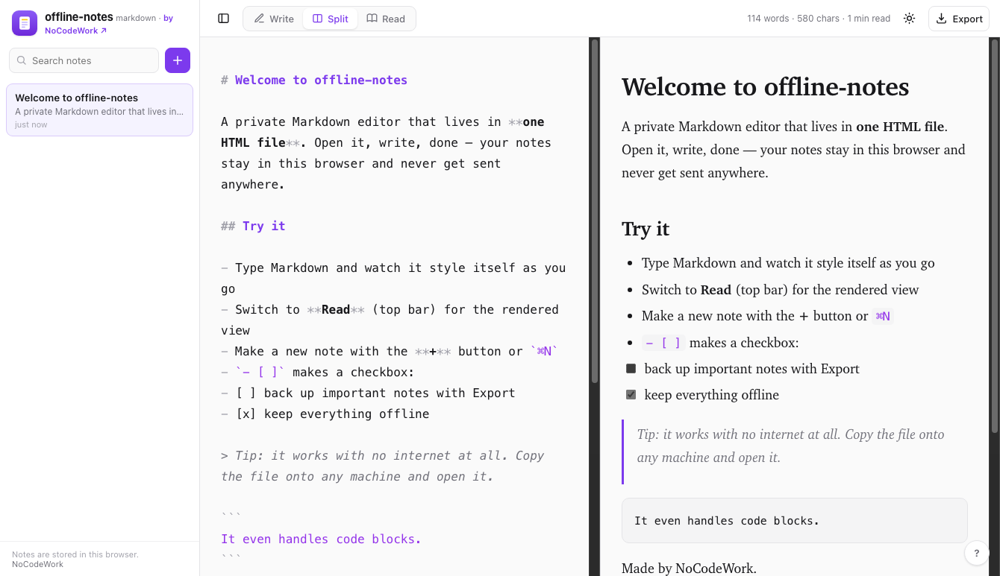

<div align="center">


# offline-notes

A Markdown editor that's just one HTML file. Open it, start writing, and it renders as you type. No signup, no install, and nothing leaves your browser.

[](LICENSE)


**[Open the live demo](https://nocodework.github.io/offline-notes/)** and write something right now, or [download `index.html`](https://raw.githubusercontent.com/nocodework/offline-notes/main/index.html) and open it on any machine, even one with no internet.



</div>

## The idea

I wanted a quick place to jot notes in Markdown without signing into anything or installing an app. Most editors either live in the cloud (Bear, Notion) or want you to download a program (Obsidian, iA Writer). On a work laptop with no internet, or one locked down by IT, none of that helps.

So this is a Markdown editor in a single file. You open it and write. The text styles itself as you type, like iA Writer, and a Reading view shows the fully rendered page. Your notes are saved in this browser and never sent anywhere. If you want to check, open the Network tab and reload: the only thing that loads is the page itself.

Because the notes live in your browser, they're tied to that browser on that machine. For anything you want to keep, use Export to save a real `.md` or `.html` file you own.

## What it does

- A focused writing pane that highlights Markdown live as you type (headings, bold, italic, code, quotes, lists, links)
- A Reading view and a Split view, so you can see the rendered page next to your text
- A sidebar of notes with search, like a small notebook
- Light and dark themes
- Word count and reading time
- Saves to the browser automatically, plus export to `.md` / `.html` and import `.md`
- Shortcuts: bold, italic, link, new note

## Markdown it understands

Headings, bold and italic, inline code and fenced code blocks, blockquotes, ordered and unordered lists, task lists (`- [ ]`), links, images, horizontal rules, and strikethrough.

## Using it

Open the [live demo](https://nocodework.github.io/offline-notes/) and start writing. To use it offline, download `index.html` and double-click it. It's a static file, so you can keep it on a USB stick, drop it on any web host, or `git clone` and open it. No server, no build step.

Grab the file from a terminal (this also works inside Claude Code or Codex):

```bash
curl -O https://raw.githubusercontent.com/nocodework/offline-notes/main/index.html
open index.html      # macOS  ·  Linux: xdg-open index.html  ·  Windows: start index.html
```

You can also open a note straight from a link by passing Markdown in the URL hash, which makes it easy to hand content to it from a script or an AI tool:

```
index.html#md=%23%20Hello%0A%0AThis%20note%20was%20opened%20from%20a%20link
```

## Use it with Claude Code

This repo ships a small [Claude Code](https://claude.com/claude-code) skill, **donotes**, that opens Markdown straight in offline-notes — handy when you want to read or edit something an AI wrote in a real editor instead of the terminal.

```bash
git clone https://github.com/nocodework/offline-notes
cp -r offline-notes/claude-skill/donotes ~/.claude/skills/
```

Then in Claude Code, say *"open this in offline-notes"* or *"put these notes somewhere I can edit them"*. It base64-encodes the Markdown and opens the editor with it preloaded. Point it at a local `index.html` and it works offline too. See [`claude-skill/donotes`](claude-skill/donotes/SKILL.md).

## Keyboard shortcuts

| Key | Action | Key | Action |
|---|---|---|---|
| `⌘B` | Bold | `+` | New note |
| `⌘I` | Italic | `⌘S` | Save now |
| `⌘K` | Link | `Tab` | Indent (`⇧Tab` to outdent) |

## What's private about it

There's no backend, so there's nowhere for your notes to go. No account, no cookies, no analytics, and no fonts pulled from a CDN. Notes sit in your browser's local storage on your own device. Export saves a copy; deleting a note or clearing site data removes it. The whole thing is one readable file, so if you'd rather not take my word for it, open `index.html` and read it.

## How it works

Plain JavaScript, no libraries. The writing pane is a real `<textarea>` with a highlight layer rendered underneath it in a monospace font, so the colored and bold text never shifts your cursor. The Reading view and the HTML export run the same small Markdown parser, which escapes everything first, so note content can't inject markup. State is a list of notes saved to local storage.

## How it compares

|  | offline-notes | Bear / Notion | iA Writer / Obsidian |
|---|:---:|:---:|:---:|
| Works with no internet | yes | no | yes |
| No account | yes | no | yes |
| Nothing to install | yes | app or web | needs install |
| Single file you own | yes | no | no |
| Open source | yes | no | Obsidian: no |

It's deliberately small: a Markdown notebook you can carry around in one file. If you need sync across devices or plugins, Obsidian or Bear will serve you better.

## Part of the offline series

offline-notes is one of a small family of single-file, offline-first tools by NoCodeWork. Same idea every time: one HTML file, no account, no server, works offline.

- [**offline-whiteboard**](https://github.com/nocodework/offline-whiteboard) — sticky notes, shapes and arrows on an infinite canvas ([demo](https://nocodework.github.io/offline-whiteboard/))
- **offline-notes** — you're here
- [**offline-sketch**](https://github.com/nocodework/offline-sketch) — a pressure-sensitive sketchpad ([demo](https://nocodework.github.io/offline-sketch/))

<a href="https://nocodework.github.io/offline-whiteboard/"></a>
<a href="https://nocodework.github.io/offline-sketch/"></a>

## Contributing

Issues and pull requests are welcome, see [CONTRIBUTING.md](CONTRIBUTING.md). It's one file with no toolchain, so there's nothing to set up first.

## License

[MIT](LICENSE), by [NoCodeWork](https://nocodework.io). Do whatever you want with it.

---

<div align="center">
Built by <a href="https://nocodework.io">NoCodeWork</a>, where we make automation and AI apps for companies.
</div>
